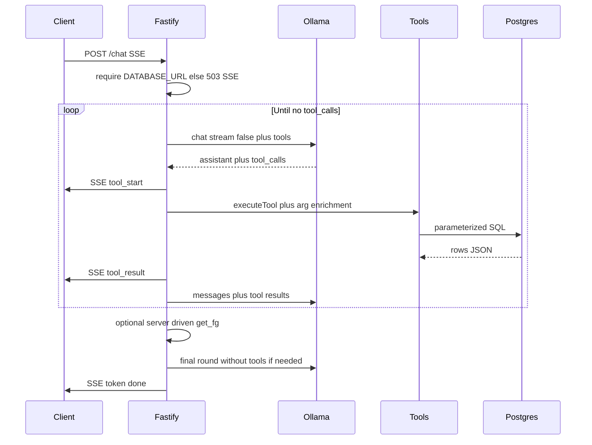

# Chat execution plan (record)

This document records the **agreed plan** and **as-built behavior** for Postgres-backed Ollama chat on `POST /chat` (SSE + tools). It is for **record keeping** and onboarding; operational testing lives in [CHAT_API_TESTING.md](./CHAT_API_TESTING.md).

---

## 1. Objectives

- Ground answers in **database tool results** (no free-floating numeric stats).
- **Fastify** `POST /chat` → **SSE** to the client.
- **Ollama** `/api/chat` with a **tool registry**: parameterized SQL (and thin repos) against `dim_player`, `player_external_identifier`, `fg_*_season_current`, `statcast_pitch`.
- **Fail closed** when Postgres is not configured (`DATABASE_URL` missing).

---

## 2. Requirements checklist (plan vs shipped)

| # | Requirement | Shipped |
|---|-------------|---------|
| 1 | Keep `POST /chat` + SSE; preserve `token`, `error`, `done` | Yes — [`apps/api/src/routes/chat.ts`](../apps/api/src/routes/chat.ts) |
| 2 | Ollama `/api/chat` with **tools**; loop until no `tool_calls` | Yes — [`apps/api/src/services/ollama.ts`](../apps/api/src/services/ollama.ts) (**implementation note:** rounds use `stream: false`; see §5) |
| 3 | Tool registry: JSON Schema for Ollama + Zod-validated handlers; **no** string-built SQL from model text | Yes — [`tools/registry.ts`](../apps/api/src/tools/registry.ts), [`tools/schemas.ts`](../apps/api/src/tools/schemas.ts), [`repos/*`](../apps/api/src/repos/) |
| 4 | `resolve_player` (name / `key_mlbam` / `id_fangraphs` + externals) | Yes — [`repos/players.ts`](../apps/api/src/repos/players.ts) + [`argEnrichment.ts`](../apps/api/src/tools/argEnrichment.ts) |
| 5 | `get_fg_season_line` (current views; join by `player_id` and/or fangraphs id; caps; `rate_stat_qualified` in row shape) | Yes — [`repos/fangraphsSeason.ts`](../apps/api/src/repos/fangraphsSeason.ts); views must include V4 columns (**Flyway V5** refresh) |
| 6 | `compare_players_career` (two resolves + merged FG payload) | Yes — [`repos/comparePlayers.ts`](../apps/api/src/repos/comparePlayers.ts) |
| 7 | Statcast snippets: pitch mix, batter batted-ball summary, sample rows (MLBAM + year; bounded) | Yes — [`repos/statcast.ts`](../apps/api/src/repos/statcast.ts) |
| 8 | System prompt: honest numerics; do not contradict tool JSON | Yes — `SYSTEM_PROMPT` in [`ollama.ts`](../apps/api/src/services/ollama.ts) |
| 9 | SSE **`tool_start`** / **`tool_result`** (+ shared Zod types) | Yes — [`packages/shared/src/index.ts`](../packages/shared/src/index.ts) |
| 10 | **`ui_attachment`** / rich cards | **Out of scope** — not implemented |
| 11 | Ops: `DATABASE_URL`, `pg`, dotenv | Yes — [`db/pool.ts`](../apps/api/src/db/pool.ts), [`package.json`](../apps/api/package.json), [`index.ts`](../apps/api/src/index.ts) `onClose` |
| 12 | Lightweight automated tests for tools | **Gap** — manual doc only: [CHAT_API_TESTING.md](./CHAT_API_TESTING.md) |

---

## 3. Architecture (as built)

---

## 4. File map

| Layer | Path |
|--------|------|
| Route + SSE headers | `apps/api/src/routes/chat.ts` |
| Ollama loop, system prompt, server-driven FG, strip echo | `apps/api/src/services/ollama.ts` |
| Tool defs + `executeTool` | `apps/api/src/tools/registry.ts` |
| Zod arg schemas | `apps/api/src/tools/schemas.ts` |
| Heuristic arg repair + `parseArgs` | `apps/api/src/tools/argEnrichment.ts` |
| DB pool | `apps/api/src/db/pool.ts` |
| Repos | `apps/api/src/repos/players.ts`, `fangraphsSeason.ts`, `statcast.ts`, `comparePlayers.ts`, `rowJson.ts` |
| Shared SSE / request types | `packages/shared/src/index.ts` |
| Views after `rate_stat_qualified` | `db/sql/V5__fg_season_current_views_refresh.sql` (after `V4__fg_season_rate_stat_qualified.sql`) |

---

## 5. Intentional deviations and mitigations

| Topic | Plan / expectation | As built | Rationale |
|--------|--------------------|----------|-----------|
| Ollama streaming | Stream `true`, accumulate deltas | **`stream: false`** per round | Reliable `tool_calls` and `function.arguments`; avoids replay JSON errors |
| `function.arguments` replay | (implicit) | **Objects** in history via `toolCallsForOllamaReplay` | Ollama 400 if arguments stay JSON strings in replay |
| Second FG tool | Model always chains | **`maybeServerDrivenFgSeasonLine`** | User asked for FanGraphs + resolve succeeded + no `get_fg` in transcript → host runs `get_fg` once |
| Wrong `player_id` | Model passes correct id | **`argEnrichment`** forces single resolve candidate’s `player_id` for `get_fg_season_line` | Small models send bogus ids (e.g. `1`) |
| Compare tool types | Strict Zod booleans / numbers | **`comparePlayersCareerArgsSchema`** coerces `"true"`/`"false"` and `"2007"`-style years | Matches common Ollama JSON for `compare_players_career` |
| FG view columns | `f.*` always current | **V5** drops/recreates `fg_*_current` after V4 | PostgreSQL fixes `SELECT f.*` column list at view creation time |
| Token UX | Stream tokens | Often **one `token` per model round** | Tradeoff for non-streaming Ollama rounds |

---

## 6. Environment

| Variable | Role |
|----------|------|
| `DATABASE_URL` | Required for `/chat`; missing → **503** + SSE error |
| `OLLAMA_HOST` | Ollama base URL |
| `OLLAMA_MODEL` | Must support **tool calling** |
| `PORT` | API port (default 3001) |

---

## 7. Out of scope and follow-ups

- **Out of scope:** `ui_attachment`, rich player cards from chat, RAG/memory (separate initiatives).
- **Follow-ups:** API unit tests for Zod + `argEnrichment`; optional UI for `tool_start` / `tool_result`; optional slim `stats_jsonb` for chat payloads; optional true token streaming on final assistant-only round. **Compare UX:** career rollup vs season-level payloads and grounding—see [CHAT_COMPARE_TOOL_CRITIQUE_AND_REQUIREMENTS.md](./CHAT_COMPARE_TOOL_CRITIQUE_AND_REQUIREMENTS.md).

---

## 8. Related documents

- Manual tests: [CHAT_API_TESTING.md](./CHAT_API_TESTING.md)
- Compare tool critique and future requirements: [CHAT_COMPARE_TOOL_CRITIQUE_AND_REQUIREMENTS.md](./CHAT_COMPARE_TOOL_CRITIQUE_AND_REQUIREMENTS.md)
- SQL examples: [sql-examples.md](./sql-examples.md)
- Schema / FG qualification: [SCHEMA_PROPOSAL.md](./SCHEMA_PROPOSAL.md), [DATASETS.md](./DATASETS.md)
- Runbook: [README.md](../README.md)
