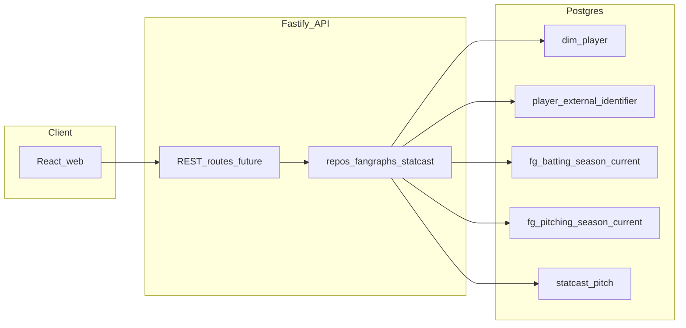

# Player cards — requirements (v1)

**Status:** **v1 shipped** — REST routes under `/players/...` and the MUI card surfaces in `apps/web` implement this contract for core FanGraphs tables + Statcast panels (spray, movement, summary, bat-path mini-graphics). This file remains the **scope + data mapping + layout** contract; **deferred** items (league cohort percentiles, chat-driven `ui_attachment`, etc.) are called out in linked docs and later sections.

**Related:** [STATCAST_REQUIREMENTS.md](./STATCAST_REQUIREMENTS.md) (Statcast ETL), [SCHEMA_PROPOSAL.md](./SCHEMA_PROPOSAL.md) (FG v1 columns, units), [calculations-and-viz.md](./calculations-and-viz.md) (derived metrics, rollups), [sql-examples.md](./sql-examples.md) (validation SQL), [CHAT_EXECUTION_PLAN.md](./CHAT_EXECUTION_PLAN.md) (chat vs cards), [DATASETS.md](./DATASETS.md) (compliance). As-built query patterns: [`../apps/api/src/repos/fangraphsSeason.ts`](../apps/api/src/repos/fangraphsSeason.ts), [`../apps/api/src/repos/statcast.ts`](../apps/api/src/repos/statcast.ts).

---

## 1. Purpose and audience

This document is the **single source of truth** for what a **v1 player card** must show, what data backs it, and what is explicitly deferred. Primary readers: **product owner**, **frontend**, and **API** implementers.

---

## 2. Definitions

- **Player card:** One screen (or full-height panel) for **one** row in **`dim_player`**, **one MLB season**, and **one primary Statcast role** for pitch-level panels:
  - **Batter card:** Statcast rows where `batter_mlbam = dim_player.key_mlbam` (requires `key_mlbam` populated).
  - **Pitcher card:** Statcast rows where `pitcher_mlbam = dim_player.key_mlbam`.
- **Season alignment:** FanGraphs uses **`season`** (smallint). Statcast uses **`game_year`**. For v1, treat them as the **same calendar-year season** when both panels are shown, per [STATCAST_REQUIREMENTS.md](./STATCAST_REQUIREMENTS.md) §3 (`game_year` / default date windows).
- **FanGraphs “current” rows:** Application reads **`fg_batting_season_current`** and **`fg_pitching_season_current`** (latest ingest per grain), not raw `fg_*_season` tables for primary UI.
- **Ohtani-style players:** FG may have **both** batting and pitching rows. UI must expose an explicit **role** (batting vs pitching) or separate entry points; Statcast panels follow the selected role.

---

## 3. User goals (v1)

- See the **default FanGraphs season line** (v1 typed columns) for MLB (or chosen `level`).
- See **Statcast-backed** summaries: pitch mix and movement (pitcher); batted-ball summary and optional spray/zone (batter).
- Understand **data freshness** (`ingest_pulled_at` on FG) and **rate-stat qualification** (`rate_stat_qualified`).
- **No** in-app **league percentile sliders** or cohort-ranked Statcast comparisons in v1 (see §5).

---

## 4. In scope (v1)

- **Page layout (locked):** Two main columns — **left:** bio + FanGraphs stats table; **right:** Statcast charts / dataviz. On **narrow viewports**, **stack** columns (left block first, then right) unless product later chooses horizontal scroll.
- **Identity (left header):** `name_first`, `name_last`, `birth_date` / age, `key_mlbam` when present, FanGraphs id via `player_external_identifier` (`id_system = 'fangraphs'`).
- **FG panel (left):** One or more rows from **`fg_batting_season_current`** or **`fg_pitching_season_current`** with the same join semantics as **`getFgSeasonLines`** in [`fangraphsSeason.ts`](../apps/api/src/repos/fangraphsSeason.ts) (`player_id` match OR external id match on `id_fg`). Support **multi-team** splits for a season (tabs, stacked rows, or team filter — UX choice).
- **Statcast panel (right):** Capabilities aligned with existing repos — pitch-type mix + avg velo; batter BBE / avg EV / avg LA; **capped** raw samples for scatter plots. Enforce the same **year clamp** and **row limits** as [`statcast.ts`](../apps/api/src/repos/statcast.ts) (`MIN_YEAR` 2010, `MAX_YEAR` 2030, sample cap 200, mix query unbounded at DB level but UI should not request full-season dumps without pagination — see §9).
- **Formatting:** FG rates stored as **decimals** (e.g. `0.105` = 10.5%); UI may multiply by 100 for display. See [SCHEMA_PROPOSAL.md](./SCHEMA_PROPOSAL.md) §units.

---

## 5. Out of scope (v1)

- **League / cohort Statcast percentiles** (Savant-style sliders, “velocity vs league”, spray heatmap baselines vs league) until a **versioned cohort spec** and **precomputed rollups / materialized views** exist. See [calculations-and-viz.md](./calculations-and-viz.md).
- **Chat-embedded rich cards** / `ui_attachment` — recorded as out of scope for chat in [CHAT_EXECUTION_PLAN.md](./CHAT_EXECUTION_PLAN.md); player cards are a **separate** surface.
- **Redistribution** of commercial datasets beyond this app’s database — [DATASETS.md](./DATASETS.md).

**Clarification — FanGraphs index stats (e.g. wRC+) are in v1:** Stats such as **wRC+** are **FanGraphs-provided** typed columns on the season line. They are **not** the same product/engineering effort as **building Statcast league distributions** in-app. **wRC+** and similar belong on the **left** FG table in v1.

---

## 6. Data prerequisites and empty states

| Condition | UX |
|-----------|-----|
| No FG row for `player_id` + `season` + `level` | Message: no FanGraphs line; suggest wrong season, minors-only, or `pnpm etl:fg` not run. |
| `key_mlbam` null | Statcast panels unavailable; show FG-only if FG exists; explain Chadwick / `pnpm etl:chadwick`. |
| No `statcast_pitch` rows for `(mlbam, game_year)` | Message: no Statcast data for this player/year; suggest `pnpm etl:statcast` in batter/pitcher mode. |
| Spray / arm angle / spin keys missing from `payload_jsonb` | Hide or grey out dependent viz; do not fail the whole card. |

---

## 7. API requirements (v1)

**Auth:** Local-first v1 assumes **no** authentication unless product adds it later.

**Implementation:** Fastify serves paths **without** the `/api` prefix (e.g. `GET /players/:playerId`). The Vite dev proxy strips `/api` when forwarding, so the **browser** calls `GET /api/players/...` → `http://localhost:3001/players/...`.

JSON uses **numbers** for numerics; FG `*_pct` fields remain **decimals** in JSON (UI × 100 for display).

### `GET /api/players/lookup` → `GET /players/lookup`

| Query | Notes |
|-------|--------|
| `key_mlbam` | required positive integer (MLBAM) |

- **200:** Same shape as `GET /players/:playerId` for the **single** matching row.
- **404:** no `dim_player` row with that `key_mlbam`.
- **409:** more than one candidate (unusual); body includes `candidates` — pick `player_id` manually.

**Web shortcut:** `GET /players/mlbam/:mlbam` on the Vite app resolves via this endpoint and **redirects** to `/players/:playerId` (preserves query string).

### `GET /api/players/:playerId` → `GET /players/:playerId`

- **200:** `{ player_id, key_mlbam, name_first, name_last, birth_date, externals: [{ id_system, id_value }] }`
- **404:** unknown `player_id`

### `GET /api/players/:playerId/fg-season` → `GET /players/:playerId/fg-season`

| Query | Notes |
|-------|--------|
| `role=batting\|pitching` | required |
| `season` | optional single year |
| `season_from`, `season_to` | optional range |
| `team`, `level` | optional filters |
| `limit` | optional; server clamps to **≤ 30** (match `fangraphsSeason.ts` `MAX_ROWS`) |

**200:** array of FG row objects matching `BATTING_COLS` or `PITCHING_COLS` from [`fangraphsSeason.ts`](../apps/api/src/repos/fangraphsSeason.ts) (including `rate_stat_qualified`, `stats_jsonb`, `ingest_pulled_at`).

### `GET /api/players/:playerId/jaws-expanded` → `GET /players/:playerId/jaws-expanded`

| Query | Notes |
|-------|--------|
| `role=batting\|pitching` | required |

**200:** BRef-style **expanded JAWS** payload (FanGraphs **fWAR** only): `player` (career WAR, 7yr-peak WAR = **sum** of seven best season WAR, JAWS, WAR/162), `cohort` (midrank **vs Hall of Famers** at the same **primary position** or SP/RP bucket; position bucket from **V28** matviews when present, else cohort MV), `hof_average` (mean career / peak / JAWS / WAR·162 for Hall of Famers at that position from `hall_of_fame_player` + JAWS cohort MV), and `notes`. Requires Flyway **V25–V29**, `pnpm etl:hall-of-fame`, `pnpm etl:chadwick`, and FanGraphs MV refresh. See [`jawsExpanded.ts`](../apps/api/src/repos/jawsExpanded.ts).

### `GET /api/players/:playerId/statcast-summary` → `GET /players/:playerId/statcast-summary`

| Query | Notes |
|-------|--------|
| `role=pitcher\|batter` | required — maps to `pitcher_mlbam` vs `batter_mlbam` filter |
| `game_year` | required; clamp 2010–2030 |
| `panel` | optional: `mix` \| `batted_ball` \| `sample` \| `bat_path`. **Omit** `panel` to return **all panels valid for that role** in one JSON object. `mix` only for `role=pitcher`; `batted_ball` and `bat_path` only for `role=batter`. |

**Semantics (align with repos):**

- **`mix` (pitcher only):** same shape as `statcastPitcherPitchMix` — `pitch_type`, `pitches`, `pct`, `avg_velo`.
- **`batted_ball` (batter only):** same shape as `statcastBatterBattedBall` — `bbe`, `avg_ev`, `avg_la`.
- **`bat_path` (batter only):** `statcastBatterBatPathSummary` — player vs league averages among rows with `bat_speed` in `payload_jsonb` (`player_tracked_swings`, `league_tracked_swings`, `player_avg_*`, `league_avg_*` for bat speed, attack angle/direction, swing path tilt). Includes **`batter_stand`** (`R` / `L`, modal `stand` on tracked swings) for UI that depends on handedness.
- **`sample`:** capped pitch rows for movement / zone (`limit` clamped 1–200), columns aligned with `statcastSampleRows` in [`statcast.ts`](../apps/api/src/repos/statcast.ts).

**Response notes:** Responses include **`game_year`** (query echo) and **`game_year_effective`** (clamped to 2010–2030, same as [`statcast.ts`](../apps/api/src/repos/statcast.ts) `clampGameYear`) so clients know which season was queried when the request was out of range.

**503:** database unavailable (match `/api/chat` posture if shared pool).

---

## 8. UI / UX requirements (v1)

- **Layout:** Left = bio + FG table; right = Statcast visualizations. See §13 wireframes.
- **Responsive:** Stack on small breakpoints.
- **Navigation:** Prefer a **dedicated route** (e.g. `/players/:id?season=2024&role=batting`) for deep linking; exact path is implementation detail.
- **Controls:** Season selector; role toggle when both FG batting and pitching exist; loading and error states per panel (partial render when one data source fails).
- **Movement plot:** One **shared** `pfx_x` / `pfx_z` convention and optional polar transform — see [calculations-and-viz.md](./calculations-and-viz.md) §movement clock.

---

## 9. Performance

- **Server:** Parameterized SQL only; reuse caps from [`statcast.ts`](../apps/api/src/repos/statcast.ts) and [`fangraphsSeason.ts`](../apps/api/src/repos/fangraphsSeason.ts). Do not return unbounded full-season pitch lists to the client except a dedicated debug/admin path (out of v1 product surface).
- **Client:** Optional virtualization for long **career** FG tables is a **v2** nice-to-have; v1 focuses on **one season** card.

---

## 10. Testing and acceptance

- Manual: pick a `player_id` with FG + Statcast loaded; verify left table matches `get_fg_season_line` tool output and right panels match [sql-examples.md](./sql-examples.md) Statcast card section.
- **FG position JSON:** Run the validation query in [sql-examples.md](./sql-examples.md) §“FanGraphs: position field validation” after confirming the JSON key name from one sample `stats_jsonb` row.
- Automated API tests for the new routes (optional follow-up).

**Example curls** (API on port 3001; use `/api/...` from the Vite dev server on 5173):

```bash
curl -s "http://127.0.0.1:3001/players/lookup?key_mlbam=545361" | jq .
curl -s "http://127.0.0.1:3001/players/1" | jq .
curl -s "http://127.0.0.1:3001/players/1/fg-season?role=batting&season=2024&level=MLB" | jq .
curl -s "http://127.0.0.1:3001/players/1/statcast-summary?role=batter&game_year=2024" | jq .
curl -s "http://127.0.0.1:3001/players/1/statcast-summary?role=pitcher&game_year=2024&panel=mix" | jq .
```

---

## 11. Traceability

| Area | Artifact |
|------|------------|
| FG DDL + views | [`../db/sql/V2__domain_schema.sql`](../db/sql/V2__domain_schema.sql), V3–V5 migrations |
| Statcast DDL | `statcast_pitch` in V2 |
| FG ETL | [`../etl/mlbapp_etl/fg.py`](../etl/mlbapp_etl/fg.py) |
| Statcast ETL | [`../etl/mlbapp_etl/statcast.py`](../etl/mlbapp_etl/statcast.py) |
| FG / Statcast repos | [`../apps/api/src/repos/fangraphsSeason.ts`](../apps/api/src/repos/fangraphsSeason.ts), [`../apps/api/src/repos/statcast.ts`](../apps/api/src/repos/statcast.ts) |
| Chat tools (reference queries) | [`../apps/api/src/tools/registry.ts`](../apps/api/src/tools/registry.ts) |
| Player REST (cards + MLBAM lookup) | [`../apps/api/src/routes/players.ts`](../apps/api/src/routes/players.ts), [`../apps/web/src/pages/PlayerMlbamRedirect.tsx`](../apps/web/src/pages/PlayerMlbamRedirect.tsx) |
| FG column visual lock | [`./reference/fg-player-page-v1/README.md`](./reference/fg-player-page-v1/README.md) |

---

## 12. Owner sign-off

| Item | Approved |
|------|----------|
| Two-column layout (left bio + FG, right Statcast); stack on narrow | ☐ |
| Season = `game_year` aligned with FG `season` for same calendar year (per Statcast doc) | ☐ |
| Multi-team FG rows UX choice documented (tabs vs list vs filter) | ☐ |
| v1 excludes Statcast league percentile UI; FG index stats (wRC+, etc.) included | ☐ |
| Proposed REST shape in §7 frozen for first implementation | ☐ |

**Signed:** __________________ **Date:** __________

---

## 13. Page layout shell (wireframes)

**Left:** Bio (name, team, season, MLBAM, age/DOB, optional position); FG season table + `rate_stat_qualified`; optional one-line Statcast KPI strip (avoid duplicating right column).

**Right:** Role-specific charts (spray, zone, mix, movement, plate location, etc.).

```
[Hitter]  +---------------------------+---------------------------+
          | LEFT                      | RIGHT                     |
          | Name · Team · Season      | [ Spray chart ]           |
          | MLBAM · Age               | [ Zone: plate_x/plate_z ] |
          | (position if available)   | [ optional KPI mini-cards]|
          |---------------------------|                           |
          | FG batting table (v1 cols)|                           |
          | rate_stat_qualified badge |                           |
          | (multi-team: tabs/rows)   |                           |
          |---------------------------|                           |
          | optional: BBE / EV / LA   |                           |
          | one-line summary          |                           |
          +---------------------------+---------------------------+
          narrow: LEFT block stacks above RIGHT block
```

```
[Pitcher] +---------------------------+---------------------------+
          | LEFT                      | RIGHT                     |
          | Name · Team · Season      | [ Pitch mix % / velo ]    |
          | MLBAM · Age               | [ Movement pfx_x/z ]      |
          |---------------------------| [ Plate location plot ]   |
          | FG pitching table         | [ arm angle overlay opt]  |
          | rate_stat_qualified badge |                           |
          +---------------------------+---------------------------+
```

---

## 14. Pseudocode legend

- `player` ← `SELECT * FROM dim_player WHERE player_id = :id`
- `ext_fg` ← `SELECT id_value FROM player_external_identifier WHERE player_id = :id AND id_system = 'fangraphs'`
- `fgBat(S)` ← row(s) from `fg_batting_season_current` for player / `id_fg` + `season` + `level` (join as in [`fangraphsSeason.ts`](../apps/api/src/repos/fangraphsSeason.ts))
- `fgPit(S)` ← same for `fg_pitching_season_current`
- `scAsBatter(Y)` ← `statcast_pitch WHERE game_year = Y AND batter_mlbam = player.key_mlbam`
- `scAsPitcher(Y)` ← `statcast_pitch WHERE game_year = Y AND pitcher_mlbam = player.key_mlbam`
- `payload(row)` ← `row.payload_jsonb->>'key'` (keys vary)

---

## 15. Hitter card — field availability

| Panel / field | Placement | Availability | Notes |
|---------------|-----------|--------------|-------|
| Name | Left | Yes | `player.name_first`, `player.name_last` |
| Age / DOB | Left | Partial | `fgBat(season).age` or derive from `player.birth_date` |
| MLBAM | Left | Partial | `player.key_mlbam` (null until linked) |
| Headshot | Left | No v1 UI | Not in DB — see §19 |
| Position (e.g. 1B) | Left | Partial | `fgBat(season).stats_jsonb->>'<KEY>'` — confirm key; validate with §10 / [sql-examples.md](./sql-examples.md) |
| Team | Left | Yes | `fgBat(season).team` |
| FG season line table | Left | Yes | Columns per [`BATTING_COLS`](../apps/api/src/repos/fangraphsSeason.ts) |
| Qualifier badge | Left | Yes | `fgBat(season).rate_stat_qualified` |
| BBE, avg EV, avg LA | Left or Right | Yes | `statcastBatterBattedBall` logic on `scAsBatter(Y)` |
| Spray chart | Right | Partial | `payload_jsonb` `hc_x` / `hc_y` — [sql-examples.md](./sql-examples.md) |
| Zone / plate scatter | Right | Partial | `plate_x`, `plate_z`, `description` / `events` on `scAsBatter(Y)` |
| Barrel / hard-hit / xwOBAcon | Right | Partial / derived | Needs frozen definitions or `payload_jsonb` keys |
| League percentile sliders | — | No (v1) | Cohort spec + rollups |

---

## 16. Pitcher card — field availability

| Panel / field | Placement | Availability | Notes |
|---------------|-----------|--------------|-------|
| Header / bio | Left | Same as hitter | `player.*` |
| FG pitching line | Left | Yes | [`PITCHING_COLS`](../apps/api/src/repos/fangraphsSeason.ts) on `fgPit(season)` |
| Pitch mix | Right | Yes | `statcastPitcherPitchMix` on `scAsPitcher(Y)` |
| Movement plot (own pitches) | Right | Yes | `pfx_x`, `pfx_z`, `pitch_type`; cap sample size |
| Similar-player mean movement overlay | Right | Post–v1 | See §21 |
| Arm angle overlay | Right | Partial | `payload_jsonb` `arm_angle` when present |
| Spin rate | Right | Partial | Typically `payload_jsonb` (not typed V2) |
| Plate location | Right | Yes | `plate_x`, `plate_z` |
| Strike% / whiff% etc. | Right | Partial | Derived from `events` / `description` |
| League percentiles / Stuff+ | — | No (v1) | |

---

## 17. Architecture (cards vs chat)



Player cards are intended to use **REST + repos** (or equivalent) **outside** the Ollama tool loop. Chat tools remain useful as **reference implementations** of the same SQL.

---

## 18. Prototyping (v0)

**Goal:** Critique layout and empty states before wiring §7 APIs.

**Shipped in repo:** **Live card:** [`PlayerCardPage`](../apps/web/src/pages/PlayerCardPage.tsx) at **`/players/:playerId`** (e.g. [http://localhost:5173/players/484574?season=2024&role=batting](http://localhost:5173/players/484574?season=2024&role=batting)) — loads [`/api/players/...`](../apps/api/src/routes/players.ts). **Static wireframe (dev only):** [http://localhost:5173/dev/cards-wireframe](http://localhost:5173/dev/cards-wireframe) via [`../apps/web/src/app/main.tsx`](../apps/web/src/app/main.tsx).

**Alternatives:** Figma frames mirroring §13; Storybook (not configured in this monorepo today).

---

## 19. Headshot / action photo — research (parallel; not v1)

**v1:** Omit images (no URL in `dim_player`).

**Follow-up:** Evaluate legal and technical options: MLBAM content CDN patterns, terms of use, and whether a future nullable **`headshot_url`** (or similar) on `dim_player` is permissible under [DATASETS.md](./DATASETS.md) posture. Document any approved pattern in this file or DATASETS when signed off.

---

## 20. Post–v1: Statcast league / cohort percentiles

Tracked work: **versioned cohort spec** (owner-authored), **materialized views or summary tables**, refresh cadence (lazy MVP acceptable per [calculations-and-viz.md](./calculations-and-viz.md)), then UI (sliders, vs-league labels). Not part of v1 sign-off in §12.

---

## 21. Post–v1: Similar-pitcher movement baseline

**Goal:** Overlay or compare a pitcher’s **mean induced movement** per `pitch_type` to a **cohort mean** for **similar pitchers** (e.g. `arm_angle` bucket ± tolerance, SP vs RP, throws handedness).

**Dependencies:** Cohort definition + precomputed aggregates (same engineering family as §20). **Not** v1.

---

## 22. Document history

| Date | Change |
|------|--------|
| 2026-04-21 | Initial requirements from approved plan. |
| 2026-04-21 | Implemented Fastify player routes + `clampGameYear` export; README status. |
| 2026-04-21 | Web: `PlayerCardPage`, `MovementMiniPlot`, React Router (`/players/:id`, dev wireframe route). |
