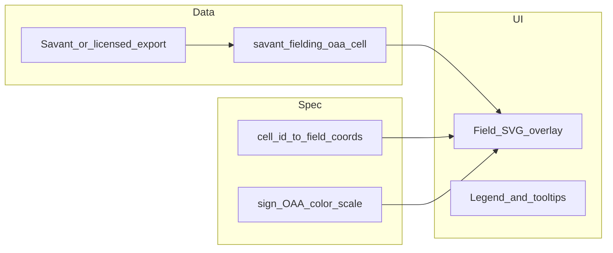

# Player cards V2 (Enhanced)

This document summarizes **HTTP APIs** and **UI** shipped for V2 comparison surfaces, extended Statcast pitch analytics, season trends, fielding, and optional OAA grid data.

## REST (Fastify; browser uses `/api` prefix via Vite proxy)

| Endpoint | Purpose |
|----------|---------|
| `GET /players/compare/fg-career?player_ids=1,2` | FanGraphs **career** aggregates for 2–4 players (`compareFgCareer`). |
| `GET /players/compare/statcast-summary?player_ids=1,2&role=pitcher\|batter&game_year=2024&enhanced=1` | Side-by-side Statcast summaries (`compareStatcastSummary`). |
| `GET /players/:id/statcast-timeseries?role=batter&metric=bat_path&from=2020&to=2024` | Yearly bat-path aggregates. `metric=pitch_mix` + `role=pitcher` returns `statcastPitcherMixByYearRange`. |
| `GET /players/:id/fg-fielding?season=2024` | FanGraphs fielding rows from `fg_fielding_season_current` (requires V14 + ETL). |
| `GET /players/:id/fielding-oaa?game_year=2024` | Reads `savant_fielding_oaa_cell` (optional ingest). |
| `GET /players/:id/statcast-summary` | Extended with `mix_extended`, `velo_dist`, `league_movement` when `enhanced=1` (default) and no single `panel` filter. |
| `GET /players/:id/league-percentiles?game_year=&role=batter\|pitcher\|fielding&position=` | Savant-style vs-league percentiles (`PercentileSlot`: `p`, `n`, `qualified`, `value`). Statcast roles read Flyway **V15** MVs (`scripts/refresh-statcast-percentile-mvs.sql`). Fielding ranks FanGraphs `drs` / `uzr` / `oaa` / `frv` at request time; `position` required when `role=fielding`. See [COHORT_PERCENTILES_SPEC.md](./COHORT_PERCENTILES_SPEC.md). |

For `role=pitcher`, responses may include **`pitcher_throws`** (`'L'` or `'R'`, else omitted), from the dominant `payload_jsonb->>'p_throws'` among that pitcher’s rows. When present, **`league_movement`** is averaged over the **same** `p_throws` cohort so hollow league markers align with the pitcher’s dots (Statcast `pfx_x` stays in the catcher frame; the chart always uses horizontal **−pfx_x**).

## Pitch movement — arm slot overlay

Client (`PlayerCardPanel` → `MovementMiniPlot`): **(1)** mean Statcast **`arm_angle`** when at least eight pitches have a **non-zero** value (many pre-2020 rows store `0`). **(2)** Otherwise a **linear fallback** on release position (feet): `−54.6857 − 4.2083·|release_pos_x| + 17.5145·release_pos_z` (see `PlayerCardPanel.tsx` constants), clipped to **[0°, 95°]**, with the same **LHP mirror** (`180° − θ`) as Savant-aligned degrees. **Known limitation:** submarine / extreme low slots **before 2020** can still look off (no real `arm_angle` + regression trained on typical slots)—accepted tradeoff.

## Materialized view

- `statcast_league_pitch_movement_rollup` — refresh after large Statcast loads:  
  `REFRESH MATERIALIZED VIEW statcast_league_pitch_movement_rollup;`  
  See [sql-examples.md](./sql-examples.md).

## FanGraphs fielding ETL

```bash
pnpm etl:fg --start-season 2024 --end-season 2024 --fielding-only --link-players
```

Uses FanGraphs JSON leaders API with `stats=fld` (`mlbapp_etl/fg_api.py`). Run for each **season range** the Fielding tab should show; without rows in `fg_fielding_season_current`, `GET …/fg-fielding` returns empty.

## OAA heat map grid

**Ingest:** **Outfield** — `pnpm etl:fielding-oaa --season 2024` → `pybaseball.statcast_outfield_directional_oaa`. **Infield** — `pnpm etl:fielding-oaa-if --season 2024` → `statcast_outs_above_average(…, 'if', …)`. Optional: `--min-opp q`, `--replace-season` (namespace-specific: `of_dir_%` vs `if_dir_%` / `if_split_%`). Manual CSV: `--csv path --game-year Y` with `--feed outfield` or `--feed infield`. Details: [STATCAST_REQUIREMENTS.md](./STATCAST_REQUIREMENTS.md) §11–11b. Compliance: [DATASETS.md](./DATASETS.md).

**Shipped today**

| Layer | Details |
|--------|---------|
| Table | `savant_fielding_oaa_cell` — PK `(player_mlbam, game_year, cell_id)`; columns `oaa`, `attempts`, `ingested_at` ([V14 migration](../db/sql/V14__statcast_league_movement_fg_fielding_oaa.sql)). |
| ETL | [`fielding_oaa_cell.py`](../etl/mlbapp_etl/fielding_oaa_cell.py) — **`of_dir_*`** (six slices) and **`if_dir_*` / `if_split_*`** (infield ingest). |
| API | `GET /api/players/:id/fielding-oaa?game_year=` — resolves `dim_player.key_mlbam`, returns `{ cells: [...] }` via `statcastFieldingOaaCells` ([`statcastFielding.ts`](../apps/api/src/repos/statcastFielding.ts)). |
| UI | [`OaaHeatmapPlaceholder.tsx`](../apps/web/src/features/fielding-oaa/OaaHeatmapPlaceholder.tsx) — **`of_dir_*`:** directional pie on the outfield SVG; anchor **LF / CF / RF** from FanGraphs innings. **`if_dir_*`:** infield diagram (`OaaIfDirectionalField`). If both OF and IF cells exist for a player-season, the UI picks **outfield vs infield** from **which side has more FanGraphs innings** (LF–RF vs 1B–SS), with ties broken toward OF unless only one side has a primary split. Other `cell_id` schemes still use the flex grid. |

### OAA defense field heat map — remaining work

This is the **spec checklist** for a spray-chart-style **field overlay** (not the current square grid). Items below are **backlog** until an approved feed and a `cell_id` → geometry map exist.

1. **Approved data source** — **Outfield** and **infield** directional grids use **`pnpm etl:fielding-oaa`** and **`pnpm etl:fielding-oaa-if`** ([STATCAST_REQUIREMENTS.md](./STATCAST_REQUIREMENTS.md) §11–11b). Further grids need additional feeds and `cell_id` namespaces.

2. **Cell vocabulary contract** — Document a stable mapping **`cell_id` → defensive responsibility zone** (Savant’s grid partition for infield vs outfield, and any position-specific schemes). Without it, cells cannot be placed on an SVG. **Proposed doc artifact:** a small table or JSON in-repo, e.g. `docs/fielding-oaa-cell-map.md` or a module under `apps/web/src/features/fielding-oaa/`, versioned when Savant changes the grid.

3. **Geometry layer** — Reuse **SVG field** patterns from [`SprayChart.tsx`](../apps/web/src/features/spray-chart/SprayChart.tsx) (100×100 viewBox, Savant `hc_x` / `hc_y` semantics, [csv-docs](https://baseballsavant.mlb.com/csv-docs)) or follow **official Savant diagram** specs. Decide how **primary position** (e.g. SS vs CF) selects **infield-skew vs outfield-skew** grid layouts if the export is not uniform.

4. **Color scale** — **Diverging:** red = **positive** OAA, blue = **negative** (matches the current placeholder). **Accessibility:** add a **color-blind-safe** palette option (e.g. blue–orange or a signed ramp) and do not rely on hue alone; keep **legend** + tooltips (placeholder includes a short legend when data exists).

5. **Directional narrative** — Phrases like “stronger to his right” need a defined frame: **mirror-aware** labels (fielder facing the plate) vs **LF/RF** foul-line language; or **paired aggregates** from upstream. A correct **`cell_id` → wedge/sector** mapping on the field SVG may be enough without extra aggregates.

6. **Attempts weighting** — Carry **size and/or opacity** by `attempts` into the field view so rare cells are not read like full samples (placeholder already weights square size by √attempts).

7. **Optional schema/API** — Consider joining on `player_id` (in addition to `player_mlbam`) for consistency with the rest of the app. **Multi-position seasons** may need `position` on the row or **separate series** per position.



## Chat tools

Ollama may call `statcast_compare_statcast_summary` (name queries + `game_year` + optional `role`).

## Web routes

- `/compare/career?player_ids=a,b`
- `/compare/statcast?player_ids=a,b&role=pitcher&game_year=2024`

Chat phrases such as “Compare X and Y” open the **compare sidebar**; Statcast-oriented wording sets `mode=statcast`.

---

## Roadmap (UX + data) — outlined plan

**Shipped in repo (incremental):** `Tm` column on FG season tables; **position + team** chips (from `team_display` / `position_display` on card API); **Batting | Pitching | Fielding** toggle (`role=fielding`) with fielding-only column; **`/players/:id/trends`** career page (bat speed MVP); **league avg** dashed line + **mph** grid on bat-speed spark; **League percentiles** (`GET /players/:id/league-percentiles`, Flyway V15 MVs + FG fielding ranks; `pnpm db:refresh-percentiles` after Statcast loads).

Below is the **remaining** sequencing and deeper scope.

### 1. Percentile sliders (MVP shipped)

**Shipped:** [COHORT_PERCENTILES_SPEC.md](./COHORT_PERCENTILES_SPEC.md) (`cohort_spec_version` **2026.2**), Flyway **V15–V20** (Statcast percentile MVs, Savant BIP MVs + sprint table, FG pitching merged stats view), `GET /players/:id/league-percentiles`, player-card **Vs league** sliders (`LeaguePercentilesPanel`), and `pnpm db:refresh-percentiles` (see [sql-examples.md](./sql-examples.md)).

**Follow-ups:** optional `p_throws` / SP-RP splits for pitcher pitch-type cohorts; xwOBA / xERA / barrel / sprint when those signals exist in-app; wire sliders to **filter** charts (today: read-only percentile display).

### 2. Fielding as its own “card” + switcher

**Goal:** **Fielding** (FG table, future OAA chart, any defensive graphs) is not buried as a subsection of the batting/pitching column. Treat it like a **third primary mode** alongside batter | pitcher.

**Plan:**

- **IA** — Top-level control: **`Batting` | `Pitching` | `Fielding`** (or `Hit` | `Pitch` | `Field`) with the same URL/query sync pattern as today’s `role=`.
- **Layout** — Dedicated **Fielding card** column (or full-width panel): FG fielding table, OAA placeholder/heatmap when data exists, small multiples by position if needed.
- **Data** — Reuse `GET /players/:id/fg-fielding` and `…/fielding-oaa`; add any **year-scoped defensive Statcast** endpoints later under the same card.
- **Routing** — e.g. `?role=fielding` or `?view=fielding` (pick one convention and redirect old links if any).

### 3. Header: primary position + current team (pills by DoB)

**Goal:** Identity row matches how fans think about the player: **how they play** and **who they play for this year**.

**Plan:**

- **Primary position** — **First-class pill** next to the existing **Born …** chip in `PlayerCardPanel` (same `Chip` row ~lines 789+). Source: **FanGraphs** season or career `stats_jsonb` position key (validate key name per [sql-examples.md](./sql-examples.md) / PLAYER_CARDS §10); fallback: modal position from fielding rows or `dim_player` if you add it.
- **Current team (selected season)** — Second pill, **driven by the same `season` selector** as the card (MLB team on the FG batting/pitching line for that year, or multi-team copy: “TOT / 3 teams” if you expose splits).
- **API** — Likely **no new endpoint** if `fg-season` already returns team per row; otherwise add a small `team_abbrev` (or array for multi-team) on the season line the UI already loads.

### 4. Team in season stats table

**Goal:** The **FanGraphs season stats** table includes a **Team** column (and optionally **Lv** if not already prominent).

**Plan:** Map FG JSON / typed columns from `getFgSeasonLines` response into the table component; handle **multi-team** rows (one row per team + TOT) without breaking sort.

### 5. Bat speed (and bat path) by season — frame of reference

**Goal:** The **bat speed by season** chart is readable vs peers, not a lone line.

**Plan:**

- **League reference** — Same timeseries endpoint (or parallel series) returns **league average bat_speed** (and optionally attack angle / path tilt) per `game_year`; render as a **dashed horizontal segment or dotted polyline** per year on the chart.
- **Y-axis** — Explicit **mph** (or native unit) **ticks** and a labeled axis (not just “index of seasons” on X and mystery Y).
- **Depends on** — Either pre-aggregated league rows in DB or a cheap aggregate query bounded by year range (document in STATCAST / sql-examples).

### 6. Career / “over time” trends — separate expanded card (optional product split)

**Question:** Should **multi-year** lines (bat speed, EV, EV90, WAR, wRC+, OOA, ERA, FIP, K%, BB%, etc.) live on the **primary season card** or on a dedicated **Career trends** surface?

**Recommendation:** **Move (or duplicate link to) long-horizon trend charts off the primary card.**

- **Primary player card** — Stays **season-selected**: “this year” mix, movement, one-year FG line, short Statcast context. Keeps load and cognitive scope tight.
- **Career trends card** — New route or deep-linkable panel, e.g. `/players/:id/trends?from=2015&to=2025`, with a **metric switcher** (tabs or dropdown), shared year range, league overlays where defined, and optional **percentile bands** once §1 exists.
- **Navigation** — From the primary card: **“View career trends →”** next to the existing bat-speed / mix trend widgets, passing default metric + year span.

This matches your instinct: **WAR / wRC+ / rate stats over time** belong with other **multi-year** signals, not mixed into the default single-season layout.

### Dependency summary

| Item | Depends on |
|------|------------|
| Percentile sliders | Cohort spec + MV/tables + API |
| Fielding card + switcher | Routing + layout refactor; data already mostly wired |
| Position / team pills | FG season payload keys (+ optional `dim_player`) |
| Team in stats table | FG row shape only |
| Bat speed chart context | League aggregate in timeseries (or new tiny endpoint) |
| Career trends page | Timeseries/generalized metrics API + new route + nav |
