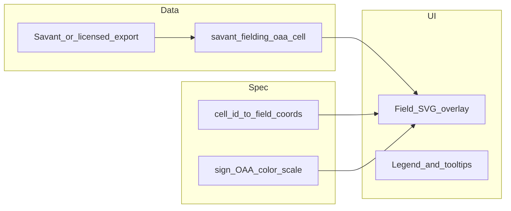

# Player card enhancements plan

This file is the **repository copy** so agents and reviewers can cite a stable path: `mlbapp/docs/PLAYER_CARD_ENHANCEMENTS_PLAN.md`. Keep it aligned with workflow when implementation lands.

## Current state (grounded in repo)

| Area | Where it lives | Notes |
|------|----------------|-------|
| Bio | [`PlayerCardPanel.tsx`](../apps/web/src/PlayerCardPanel.tsx) (~884–926) | Name, born chip, FG position + team chips, MLBAM |
| FanGraphs “By season (MLB)” | Same file + [`BattingCardTable`](../apps/web/src/PlayerCardPanel.tsx) (~287–330) / [`PitchingCardTable`](../apps/web/src/pitcherFgTables.tsx) (~142–185) | `seasonLabel` is `String(season)` for season rows (`batterFgTables.ts`), **no** linkage to URL season for row styling |
| Statcast stack order | [`PlayerCardPanel.tsx`](../apps/web/src/PlayerCardPanel.tsx) (~1062–1184) | **Pitching:** `LeaguePercentilesPanel` → Pitch mix → movement. **Batting:** percentiles → BBE chips → bat path → spray |
| Fielding OAA viz | [`OaaHeatmapPlaceholder.tsx`](../apps/web/src/OaaHeatmapPlaceholder.tsx), table [`savant_fielding_oaa_cell`](../db/sql/V14__statcast_league_movement_fg_fielding_oaa.sql) | Flex-wrap squares; **not** a field overlay. [§3 MLB Stats API](./data-sources/http-and-official-apis.md) (`GET /api/v1/people/{id}`) |
| Warehoused identity | [`dim_player`](../db/sql/V2__domain_schema.sql) + [`getPlayersByIds`](../apps/api/src/repos/players.ts) | Only `birth_date`, names, `key_mlbam` (+ externals)—**no** height/weight/draft in schema today |

---

## 1. More biographical information

**Investigation summary**

- **Highest leverage, already aligned with IDs:** **[MLB Stats API](https://statsapi.mlb.com/)** `/api/v1/people/{personId}` (see [§3](./data-sources/http-and-official-apis.md)). With `player.key_mlbam`, you can typically obtain **bat/throw**, **height/weight**, **birth city/state/country**, and richer birth metadata than bare `birth_date`; verify exact JSON keys in a one-off probe (people payloads evolve).
- **Draft line (year / round / pick / signing team / school)** often appears on **people** bio objects or linked resources in the Stats API; if not consistently present on `people/{id}`, use discovery notes to pick the correct **nested endpoint** or `hydrate=` query MLB documents for that season—do **not** assume one field until verified.
- **FanGraphs `stats_jsonb`:** Leaders rows are intentionally wide (`etl/tests/test_fg_api.py`), but FG **season stats** feeds are optimized for rate stats, **not** the same as BRef’s prose bio or full draft narrative—use FG only as supplemental if a column reliably exists after inspection.
- **Awards (“3× MVP …”)**: Not in `dim_player`. Options: Stats API **awards** feeds (if available for the person), a **static** or **ETL** table from Lahman/pybaseball, or **phase 2**—call out explicitly if out of scope for v1.
- **MLB Pipeline ranks (e.g. “TOP 100: No. 99”)**: Proprietary to Pipeline; **no** first-class path in this repo unless you add a licensed feed or manual table—treat as optional / future.

**Implementation approach (snapshot-style; see Decision below)**

1. Add a small **server-side** fetch from the **official MLB Stats API** (not the app DB): **`https://statsapi.mlb.com/api/v1/people/{key_mlbam}`** (`{key_mlbam}` is MLBAM / `people.id`). Documented in-repo at [§3](./data-sources/http-and-official-apis.md). Expose your own route, e.g. `GET /api/players/:id/mlb-bio` (or extend `GET /players/:id` with `?include=mlb_bio`), that:
   - Requires `dim_player.key_mlbam` (return 404 or omit bio block if null).
   - Proxies **`GET`** to Stats API server-side only (never from the browser, to hide nothing sensitive but to centralize caching and timeouts); on success **UPSERT** normalized fields + raw JSON into **`player_bio_cache`** with `fetched_at`. Serve from DB when **`fetched_at`** is within TTL; otherwise refresh. Optional in-memory TTL on top.
   - Supplemental: HTTP `Cache-Control` / **`ETag`** / **`If-None-Match`** if MLB supports them—probe first. Map JSON → typed DTO (`height`, `weight`, `batSide`, `pitchHand`, birthplace fields, draft fields when present in payload or via **`hydrate=`** if needed).
2. Render a **Savant-like header line** under the name: `POS | Team`, then `Bats/Throws … | Ht/Wt | Age`, then draft/school lines when API returns them. Compute **age** from `birth_date` (warehouse) or API birthDate—prefer single source of truth for consistency with FG season selector.

**Why not add columns to `dim_player` immediately?** Bio text and physical attributes can be served three different ways later; the proxy route above is compatible with all of them:

- **Live:** Each card load (or each API request) fetches **current** Stats API JSON. Simplest; subject to upstream availability/latency/rate limits; no local copy of height/draft in Postgres.
- **Snapshot:** Periodically or on-demand, **persist** a copy of the Stats API (or chosen) payload in a table or JSON blob (`player_bio_cache`, or extra columns on `dim_player`), with `fetched_at`. UI reads **your** row; refresh job updates it. Survives MLB blips; historical “what we showed in March” is possible if you version rows.
- **ETL-backed:** Bio fields are **ingested in batch** from a file or API (same pattern as `pnpm etl:fg` / Chadwick): scheduled job writes **typed columns** or a side table. Cards never call MLB at request time (or only to **reconcile** deltas). Best when you need compliance, audit, or offline‑ish analytics.

**How this differs (plain terms):** The real fork is **whether bios live in your database at all**:

- **Live** — No durable bio row (only ephemeral cache if any). Every card view may hit MLB (server-side).
- **Snapshot vs ETL** — **Both persist** the same kind of facts in Postgres; the distinction is **how you fill and maintain** those rows, not a different “kind” of bio:

  - **Snapshot** = treat bio like an **application cache**: write on read when missing/stale (**TTL**), or a **lightweight** refresh job. Fewer pipeline guarantees; fine for “show height on the card.”
  - **ETL-backed** = treat bio like **warehouse data**: **scheduled** bulk runs, `ingest_snapshot`-style audit, same ops model as FanGraphs/Chadwick.

A **nightly cron** that calls Stats API and upserts a table is arguably snapshot *or* ETL depending on how you document and operate it—the labels separate **ops pattern**, not two incompatible schemas.

**Shorthand:** **Snapshot** ≈ *lazy / read-through*: first request (or staleness) triggers fetch + **upsert to DB**; optional TTL. **ETL** ≈ **scheduled batch** persistence that **does not** depend on anyone opening the card—backfill and refresh on a clock, same style as `pnpm etl:fg`.

**Decision:** Use **snapshot-style** for MLB bio: **`player_bio_cache`** (or equivalent) with `fetched_at`; **read-through** on cache miss or **stale** TTL; **no** dedicated full-warehouse ETL batch unless requirements change later.

---

## 2. Highlight selected season in “By season (MLB)”

- Pass **`season`** into [`BattingCardTable`](../apps/web/src/PlayerCardPanel.tsx) and [`PitchingCardTable`](../apps/web/src/pitcherFgTables.tsx).
- For each row where `line.seasonLabel !== 'Career'` and `Number(line.seasonLabel) === season`, apply subtle styling: e.g. `bgcolor: 'action.selected'` or left border + slightly stronger font weight (keep **Career** row visually distinct).

---

## 3. Percentiles position (move below other graphs)

In the Statcast `Stack` for **batting** and **pitching** ([`PlayerCardPanel.tsx`](../apps/web/src/PlayerCardPanel.tsx) ~1062–1184):

- **Batting:** Order → BBE chips (optional) → **BatPathSummary** → **SprayChart** → link → **`LeaguePercentilesPanel` last**.
- **Pitching:** Order → **Pitch mix** (+ extended table path) → **MovementMiniPlot** → link → **`LeaguePercentilesPanel` last**.

**Fielding** right column currently is only percentiles; no reorder needed unless you add more blocks later.

---

## 4. Collapsible graph sections (default expanded)

- Wrap each logical block (percentiles, bat path, spray, pitch mix, movement—fielding OAA placeholder when relevant) in a **collapsible** container with a **persistent header** (summary row):
  - Prefer **MUI** `Accordion` with `defaultExpanded` **true**, or **Card + Collapse** + `IconButton` for symmetry with existing Statcast rail chevrons.
- Optional: persist expansion in **`localStorage`** under a versioned key (e.g. `mlbapp.playerCard.sections.v1`) so power users keep their layout; default **all expanded** per your spec.

Extracting a tiny **`CollapsibleSection`** component in [`PlayerCardPanel.tsx`](../apps/web/src/PlayerCardPanel.tsx) or `CollapsibleChartSection.tsx` keeps the panel readable and avoids duplicating accessibility labels.

---

## 5. OAA defense heat map — what is still needed

**Already in place:** ingest target [`savant_fielding_oaa_cell`](../db/sql/V14__statcast_league_movement_fg_fielding_oaa.sql); UI shell [`OaaHeatmapPlaceholder.tsx`](../apps/web/src/OaaHeatmapPlaceholder.tsx) (`GET /api/players/:id/fielding-oaa`); compliance note in [`PLAYER_CARDS_V2.md`](./PLAYER_CARDS_V2.md) §“OAA heat map grid”.

**Spec location:** Full checklist, data contract, and geometry notes live in [`PLAYER_CARDS_V2.md`](./PLAYER_CARDS_V2.md) § **OAA defense field heat map — remaining work** (under **OAA heat map grid**).

**Gaps for “spray-chart-style field” + directional feel (document in `docs/` as a short addendum or extend [`PLAYER_CARDS_V2.md`](./PLAYER_CARDS_V2.md)):**

1. **Approved data source** for per-cell OAA (Savant grid export)—same compliance thread as today’s placeholder ([`DATASETS.md`](./DATASETS.md)).
2. **Cell vocabulary contract:** document **`cell_id` ↔ defensive responsibility zone** (e.g. Savant’s partition). Without a stable mapping, you cannot place cells on a field SVG.
3. **Geometry layer:** reuse patterns from [`SprayChart.tsx`](../apps/web/src/SprayChart.tsx) (SVG field, Savant coordinate conventions) **or** official Savant diagram specs—define whether cells anchor to **infield-skew vs outfield-skew** grids per **primary position**.
4. **Color scale:** diverging ramp **red = positive OAA**, **blue = negative OAA** (current placeholder uses hue 0 vs 220—align legend + accessibility / color-blind variant).
5. **Directional narrative (“better to his right than left”):** requires either **mirror-aware** labeling (player stands facing plate—define L/R vs LF/RF line) or **paired aggregates** exported from upstream; purely geometric mapping from `cell_id` to wedge sectors may suffice once the grid matches physical space.
6. **Attempts weighting:** opacity/size by attempts (already partially in placeholder) should carry over to the field view to avoid over-reading low-`attempts` cells.
7. **Optional schema/API:** consider `player_id` join in addition to `player_mlbam` for consistency with rest of app; multi-position years may need `position` on the grid or separate series.

---

## Suggested implementation order

1. Reorder Statcast stacks + collapsible wrappers (pure UI).
2. Season row highlight (small table prop change).
3. MLB bio API + header UI (`player_bio_cache` migration + snapshot read-through).
4. Documentation pass for OAA field heat map (§5 checklist).

**Migration note:** (1)–(2) need no DDL; **(3)** requires `player_bio_cache` (and Flyway migration) unless you defer cache to a later slice; **(4)** docs only.
