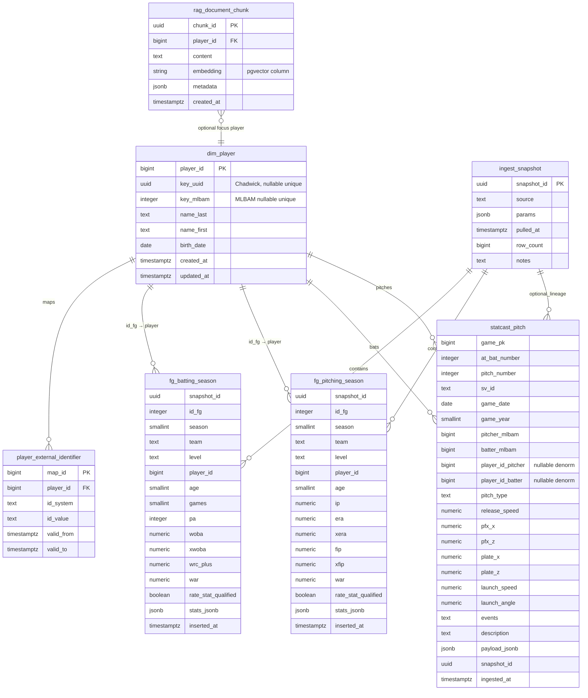

# Schema proposal + ERD (Phase A → domain migrations)

**Status:** **Owner-approved**; **Flyway V1–V3** (extensions, domain DDL, **`fg_*_season_current`** in [`../db/sql/V3__fg_season_current_views.sql`](../db/sql/V3__fg_season_current_views.sql)). **FanGraphs**, **Chadwick**, and **Statcast** ETL implemented under [`../etl/`](../etl) (`fg`, `chadwick`, `statcast`); validated — [sql-examples.md](./sql-examples.md), [STATCAST_REQUIREMENTS.md](./STATCAST_REQUIREMENTS.md). Further DDL = new Flyway versions + updates here. Ingest accessors: [data-sources/README.md](./data-sources/README.md). **Derived metrics / viz:** [calculations-and-viz.md](./calculations-and-viz.md).

**Goals:** (1) canonical **player** identity with **external id** map, (2) **FanGraphs** season facts with **snapshot lineage** and **first-class columns for player-card stats** plus **`stats_jsonb`** for the long tail, (3) **Statcast** pitch facts at natural key grain with typed card-relevant pitch/batted-ball fields and optional **`payload_jsonb`**, (4) **pgvector** store for chat/RAG alongside domain data. Naming matches the target tables named in [DATASETS.md](./DATASETS.md) with small additions (`dim_player`, ingest metadata, RAG).

---

## Design principles

1. **Surrogate PK** `player_id` in `dim_player`; **business joins** use `key_mlbam` (MLBAM) where present, plus `player_external_identifier` for FanGraphs, Baseball-Reference, Retrosheet, and Chadwick `key_uuid`.
2. **Statcast** natural key **`(game_pk, at_bat_number, pitch_number)`**; store **`sv_id`** when present for debugging/revisions. Expect **UPSERT** behavior when Savant corrects historical rows ([DATASETS.md](./DATASETS.md)).
3. **FanGraphs** rows are **snapshot-bound**: the same logical player–season–team–**level** can repeat across loads; retain **`ingest_snapshot`** for reproducibility and API params (`api_qual`, league filters, `rate_stat_qualified_rule`).
4. **Player card first, JSONB for the long tail**: **`fg_batting_season`** and **`fg_pitching_season`** store **first-class columns** for **v1 = default FanGraphs player-page** season lines (see [v1 FanGraphs default player page columns](#v1-fangraphs-default-player-page-columns)); everything else stays in **`stats_jsonb`**. Statcast keeps the existing **typed pitch-level** fields plus **`payload_jsonb`** for overflow.
5. **Partitioning**: declare **`statcast_pitch`** on **`game_year`** (list) or **`game_date`** (range) before loading multi-year MLB data; keep **extensions** in existing [`V1__extensions.sql`](../db/sql/V1__extensions.sql).

---

## Entity-relationship diagram (Mermaid)



**Relationship notes**

- **`fg_*`** → **`dim_player`**: resolve `IDfg` → `player_external_identifier(id_system='fangraphs')` → `player_id`. Ingest may leave `player_id` null until a resolution job runs.
- **`statcast_pitch`**: `pitcher` / `batter` Savant columns are MLBAM integers — FK-style reference to **`dim_player.key_mlbam`** (not enforced as FK if `dim_player` is incomplete; use **LEFT JOIN** in queries or enforce after backfill).
- **`rag_document_chunk`**: optional `player_id` for “card + chat” scoping; **no FK** to Statcast required.

---

## Table definitions (DDL sketch)

Types are illustrative; tune precisions (e.g. `numeric(6,3)`) during migration review.

### `dim_player`

Canonical person row; seed from Chadwick, reconcile with FG/Statcast usage.

```sql
CREATE TABLE dim_player (
  player_id     bigserial PRIMARY KEY,
  key_uuid      uuid UNIQUE,
  key_mlbam     integer UNIQUE,
  name_last     text NOT NULL,
  name_first    text NOT NULL,
  birth_date    date,
  created_at    timestamptz NOT NULL DEFAULT now(),
  updated_at    timestamptz NOT NULL DEFAULT now()
);

CREATE INDEX dim_player_name_idx ON dim_player (name_last, name_first);
```

### `player_external_identifier`

```sql
CREATE TABLE player_external_identifier (
  map_id      bigserial PRIMARY KEY,
  player_id   bigint NOT NULL REFERENCES dim_player (player_id) ON DELETE CASCADE,
  id_system   text NOT NULL,
  id_value    text NOT NULL,
  valid_from  timestamptz,
  valid_to    timestamptz,
  UNIQUE (id_system, id_value),
  UNIQUE (player_id, id_system)
);

CREATE INDEX player_external_identifier_player_idx ON player_external_identifier (player_id);
```

### `ingest_snapshot`

```sql
CREATE TABLE ingest_snapshot (
  snapshot_id uuid PRIMARY KEY DEFAULT gen_random_uuid(),
  source      text NOT NULL,
  params      jsonb NOT NULL DEFAULT '{}',
  pulled_at   timestamptz NOT NULL DEFAULT now(),
  row_count   bigint,
  notes       text
);

CREATE INDEX ingest_snapshot_source_pulled_idx ON ingest_snapshot (source, pulled_at DESC);
```

### `fg_batting_season` / `fg_pitching_season`

Primary key is **`(snapshot_id, id_fg, season, team, level)`** so the same FanGraphs player can have distinct rows for **MLB vs minors** (and multi-team splits remain on `team`).

**Multi-snapshot / partial refresh reads:** Chunked backfills (e.g. decade windows) and rolling season re-pulls each insert a new `snapshot_id`. Application queries should treat **`fg_batting_season_current`** and **`fg_pitching_season_current`** (Flyway V3) as the FanGraphs fact tables: **one row per `(id_fg, season, team, level)`**, choosing the physical row whose `ingest_snapshot.pulled_at` is **latest**, with deterministic tie-breaks (`inserted_at`, `snapshot_id`). Base `fg_*` tables remain the **full audit trail** (every load retained until snapshots are deleted). Each view adds **`ingest_pulled_at`** (winner’s load time). **Saved query patterns:** [sql-examples.md](./sql-examples.md).

**Ingest contract:** ETL **must** populate the **v1 first-class** columns from the FanGraphs scrape (or **NULL** only when the source field is absent). **`stats_jsonb`** holds the **full** FG row for the long tail. **`rate_stat_qualified`** (boolean, nullable for legacy / non-MLB) is **computed at ingest** from PA/IP vs an MLB schedule-length model (``etl/mlbapp_etl/fg_qualify.py``: 154-game era, strike years, 2020; see Flyway V4). Normalize FG column names with `%` or `/` into the SQL names below in one place (shared mapper).

#### v1 FanGraphs default player page columns

**Owner decision:** v1 typed columns match the **default FanGraphs player page** season stat rows (batting and pitching). **Record screenshots:** [docs/reference/fg-player-page-v1/README.md](../reference/fg-player-page-v1/README.md).

**Units (lock this in ETL):**

- **Rates shown with `%` on FG** (`BB%`, `K%`, `LOB%`, `GB%`, `HR/FB`): store as **decimal fractions** in Postgres (`0.105` = 10.5%). The API/UI multiplies by 100 for display if desired.
- **Slash / wOBA / xwOBA / BABIP / ISO:** store as **decimals** (`0.326` AVG), not strings with a leading dot.
- **`IP`:** `numeric` with one decimal place per FG convention (`42.1` = 42⅓ innings).
- **`vfa`:** average **four-seam** velo in **mph** (FG `vFA` column on the pitching page).

**Batting — column order matches default FG page**

| SQL column | FG / pybaseball (typical) |
|------------|---------------------------|
| `season` | `Season` |
| `team` | `Team` |
| `level` | `Level` (e.g. `MLB`) |
| `age` | `Age` |
| `games` | `G` |
| `pa` | `PA` |
| `hr` | `HR` |
| `r` | `R` |
| `rbi` | `RBI` |
| `sb` | `SB` |
| `bb_pct` | `BB%` → fraction |
| `k_pct` | `K%` → fraction |
| `iso` | `ISO` |
| `babip` | `BABIP` |
| `avg` | `AVG` |
| `obp` | `OBP` |
| `slg` | `SLG` |
| `woba` | `wOBA` |
| `xwoba` | `xwOBA` (or `xWOBA` — normalize in mapper) |
| `wrc_plus` | `wRC+` |
| `bsr` | `BsR` |
| `off_runs` | `Off` |
| `def_runs` | `Def` |
| `war` | `WAR` |
| `rate_stat_qualified` | computed: MLB PA ≥ ceil(schedule games × 3.1) |

**Pitching — column order matches default FG page**

| SQL column | FG / pybaseball (typical) |
|------------|---------------------------|
| `season`, `team`, `level`, `age` | as batting |
| `w`, `l`, `sv` | `W`, `L`, `SV` |
| `games`, `games_started` | `G`, `GS` |
| `ip` | `IP` |
| `k_per_9` | `K/9` |
| `bb_per_9` | `BB/9` |
| `hr_per_9` | `HR/9` |
| `babip` | `BABIP` |
| `lob_pct` | `LOB%` → fraction |
| `gb_pct` | `GB%` → fraction |
| `hr_fb_pct` | `HR/FB` → fraction |
| `vfa` | `vFA` |
| `era` | `ERA` |
| `xera` | `xERA` |
| `fip` | `FIP` |
| `xfip` | `xFIP` |
| `war` | `WAR` |
| `rate_stat_qualified` | computed: MLB IP outs ≥ schedule games × 3 |

Promote additional FG columns to typed SQL only when the UI leaves the default page.

```sql
CREATE TABLE fg_batting_season (
  snapshot_id uuid NOT NULL REFERENCES ingest_snapshot (snapshot_id) ON DELETE CASCADE,
  id_fg       integer NOT NULL,
  season      smallint NOT NULL,
  team        text NOT NULL,
  level       text NOT NULL DEFAULT 'MLB',
  player_id   bigint REFERENCES dim_player (player_id),
  age         smallint,
  games       smallint,
  pa          integer,
  hr          smallint,
  r           smallint,
  rbi         smallint,
  sb          smallint,
  bb_pct      numeric(7, 4),
  k_pct       numeric(7, 4),
  iso         numeric(6, 4),
  babip       numeric(6, 4),
  avg         numeric(6, 4),
  obp         numeric(6, 4),
  slg         numeric(6, 4),
  woba        numeric(6, 4),
  xwoba       numeric(6, 4),
  wrc_plus    numeric(7, 2),
  bsr         numeric(7, 2),
  off_runs    numeric(7, 2),
  def_runs    numeric(7, 2),
  war         numeric(5, 2),
  rate_stat_qualified boolean,
  stats_jsonb jsonb NOT NULL,
  inserted_at timestamptz NOT NULL DEFAULT now(),
  PRIMARY KEY (snapshot_id, id_fg, season, team, level)
);

CREATE INDEX fg_batting_season_player_season_idx ON fg_batting_season (player_id, season);
CREATE INDEX fg_batting_season_id_fg_season_idx ON fg_batting_season (id_fg, season);
CREATE INDEX fg_batting_season_card_sort_idx ON fg_batting_season (season, war DESC NULLS LAST)
  WHERE player_id IS NOT NULL;
```

```sql
CREATE TABLE fg_pitching_season (
  snapshot_id uuid NOT NULL REFERENCES ingest_snapshot (snapshot_id) ON DELETE CASCADE,
  id_fg       integer NOT NULL,
  season      smallint NOT NULL,
  team        text NOT NULL,
  level       text NOT NULL DEFAULT 'MLB',
  player_id   bigint REFERENCES dim_player (player_id),
  age         smallint,
  w           smallint,
  l           smallint,
  sv          smallint,
  games       smallint,
  games_started smallint,
  ip          numeric(7, 1),
  k_per_9     numeric(6, 2),
  bb_per_9    numeric(6, 2),
  hr_per_9    numeric(6, 2),
  babip       numeric(6, 4),
  lob_pct     numeric(7, 4),
  gb_pct      numeric(7, 4),
  hr_fb_pct   numeric(7, 4),
  vfa         numeric(5, 1),
  era         numeric(5, 2),
  xera        numeric(5, 2),
  fip         numeric(5, 2),
  xfip        numeric(5, 2),
  war         numeric(5, 2),
  rate_stat_qualified boolean,
  stats_jsonb jsonb NOT NULL,
  inserted_at timestamptz NOT NULL DEFAULT now(),
  PRIMARY KEY (snapshot_id, id_fg, season, team, level)
);

CREATE INDEX fg_pitching_season_player_season_idx ON fg_pitching_season (player_id, season);
CREATE INDEX fg_pitching_season_card_sort_idx ON fg_pitching_season (season, war DESC NULLS LAST)
  WHERE player_id IS NOT NULL;
```

**Serving pattern:** view `fg_batting_season_current` = latest `snapshot_id` per `(source = 'fangraphs_batting', season)` or per global “latest” depending on product rules. Card API reads **typed columns first**; uses **`stats_jsonb`** only for secondary panels.

### `statcast_pitch`

List partitioning on **`game_year`** (recommended). Typed subset + optional **`payload_jsonb`**.

```sql
CREATE TABLE statcast_pitch (
  game_pk           bigint NOT NULL,
  at_bat_number     integer NOT NULL,
  pitch_number      integer NOT NULL,
  sv_id             text,
  game_date         date,
  game_year         smallint NOT NULL,
  pitcher_mlbam     integer NOT NULL,
  batter_mlbam      integer NOT NULL,
  player_id_pitcher bigint REFERENCES dim_player (player_id),
  player_id_batter  bigint REFERENCES dim_player (player_id),
  pitch_type        text,
  release_speed     numeric,
  pfx_x             numeric,
  pfx_z             numeric,
  plate_x           numeric,
  plate_z           numeric,
  launch_speed      numeric,
  launch_angle      numeric,
  events            text,
  description       text,
  payload_jsonb     jsonb,
  snapshot_id       uuid REFERENCES ingest_snapshot (snapshot_id),
  ingested_at       timestamptz NOT NULL DEFAULT now(),
  PRIMARY KEY (game_year, game_pk, at_bat_number, pitch_number)
) PARTITION BY LIST (game_year);
```

Create partitions `FOR VALUES IN (2023)`, etc., in a migration or maintenance job. Add **`UNIQUE (sv_id)` WHERE sv_id IS NOT NULL** if you treat `sv_id` as a stable alternate key (Savant-dependent).

Indexes (on parent or each partition, per Postgres rules):

- `(pitcher_mlbam, game_date)` and `(batter_mlbam, game_date)` for player cards.
- `(game_pk, at_bat_number)` for half-inning replays.

### `rag_document_chunk` (pgvector)

Align `embedding` dimension with the embedding model you deploy (e.g. 768 / 1024 / 1536).

```sql
CREATE TABLE rag_document_chunk (
  chunk_id    uuid PRIMARY KEY DEFAULT gen_random_uuid(),
  player_id   bigint REFERENCES dim_player (player_id) ON DELETE SET NULL,
  content     text NOT NULL,
  embedding   vector(1536),
  metadata    jsonb NOT NULL DEFAULT '{}',
  created_at  timestamptz NOT NULL DEFAULT now()
);

CREATE INDEX rag_document_chunk_embedding_idx
  ON rag_document_chunk
  USING ivfflat (embedding vector_cosine_ops)
  WITH (lists = 100);
```

Switch to **HNSW** (`vector_cosine_ops`) on Postgres/pgvector versions that support it for better recall/latency tradeoffs.

---

## Optional extensions (later migrations)

| Addition | Purpose |
|----------|---------|
| `dim_team` (`team_abbrev`, `franchise_id`, league) | Normalize FG `Team` and Savant `home_team` / `away_team`. |
| `fact_game` (`game_pk`, `game_date`, `home_team`, `away_team`) | One row per game; FK from `statcast_pitch` if you want strict game metadata. |
| **Generated columns** on `stats_jsonb` | Fallback if you defer promoting a new card metric; prefer adding a real column once the card depends on it. |
| **`statcast_pitch_rollup_*`** (table or MV) | Pre-aggregated batter/pitcher summaries, **percentile cohorts**, heatmap bins — see [calculations-and-viz.md](./calculations-and-viz.md). Refresh after ingest or nightly. |

---

## Alignment checklist

| [DATASETS.md](./DATASETS.md) topic | Schema answer |
|-----------------------------------|---------------|
| FG grain player–season–team–level | PK `(snapshot_id, id_fg, season, team, level)`; **v1 = default FG player-page columns typed**, remainder in `stats_jsonb` |
| Statcast grain pitch | PK `(game_year, game_pk, at_bat_number, pitch_number)` + partition |
| FG ↔ MLBAM | `player_external_identifier` + `dim_player.key_mlbam` |
| Statcast corrections | UPSERT on natural key; optional `ingested_at` / snapshot audit |
| pgvector / chat | `rag_document_chunk` |

---

## Sign-off

- [x] Owner reviewed this proposal against [DATASETS.md](./DATASETS.md)
- [x] Ready for Flyway `V2__...` (or later) domain migration scripts (**approved**)
