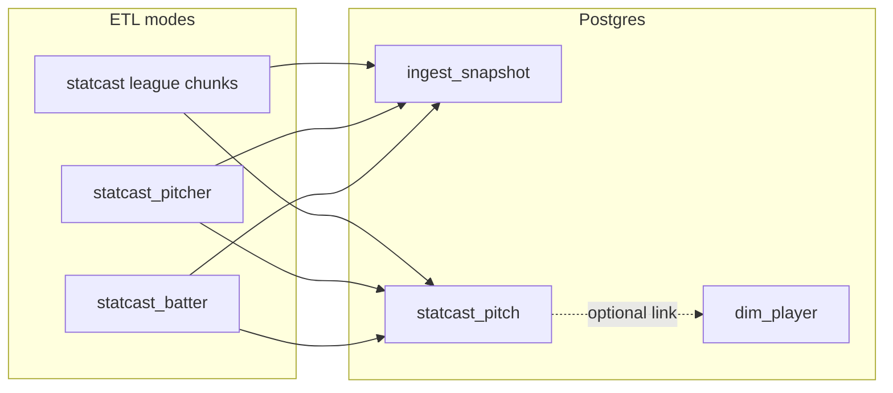

# Statcast ETL — requirements (owner sign-off)

**Status:** ETL **implemented and validated** (`pnpm etl:statcast` → `statcast_pitch`; checks in [sql-examples.md](./sql-examples.md)). **Schema:** [`statcast_pitch`](../db/sql/V2__domain_schema.sql) (Flyway V2). **Related:** [DATASETS.md](./DATASETS.md), [SCHEMA_PROPOSAL.md](./SCHEMA_PROPOSAL.md), [calculations-and-viz.md](./calculations-and-viz.md), [data-sources/README.md](./data-sources/README.md).

**Product scope (agreed):** support a **player card for one MLB season** (pitcher or batter). **Ingest modes (agreed):** **league date window** plus **player-scoped** pitcher and batter pulls, all into the same table.

---

## 1. Product scope and non-goals

### In scope (v1 ETL)

- Persist **pitch-level** Statcast rows into `statcast_pitch` so the app can serve one-season cards: velocity, movement, plate location, basic batted-ball fields where present, pitch/ball-in-play text fields, MLBAM pitcher and batter ids for joins.
- Three ingest modes (see §2), one **UPSERT** semantics contract (see §4).
- Optional **player id denorm** (`player_id_pitcher`, `player_id_batter`) via Chadwick/`dim_player` linkage (see §8).

### Out of scope (v1 ETL)

- **League percentile sliders** and other aggregates that scan the full league: separate work per [calculations-and-viz.md](./calculations-and-viz.md) (lazy rollup MVP; cohort spec owner-authored later).
- **Redistribution** of Savant-derived datasets beyond this app’s own database (compliance posture unchanged from [DATASETS.md](./DATASETS.md)).
- **`fact_game` / `dim_team`** and schedule-aware “opening day” automation unless added in a later migration and this doc is revised.

---

## 2. Ingest modes (first-class)

All modes write **`statcast_pitch`** with the same column mapping and conflict target.

| Mode | `pybaseball` | When to use |
|------|----------------|------------|
| **League window** | `statcast(start_dt, end_dt)` | League backfill, catch-up by calendar range; **must** use date chunking under Savant row caps. |
| **Player pitcher** | `statcast_pitcher(start_dt, end_dt, player_id)` | One pitcher’s pitches in a window (e.g. one season for a pitcher card). |
| **Player batter** | `statcast_batter(start_dt, end_dt, player_id)` | Same grain: **one row per pitch** for plate appearances involving that batter ([Savant batter CSV](https://baseballsavant.mlb.com/statcast_search) filtered by batter); use for batter card and spray / quality-of-contact at pitch level. |

**Requirement:** `ingest_snapshot.params` MUST record `mode`, date bounds, and when applicable `player_mlbam` (integer).

---

## 3. “One MLB season” definition (card alignment)

- **Partition / key year:** Use Savant’s **`game_year`** (smallint) for `statcast_pitch.game_year` and list partitioning. It aligns with **calendar year of the game** as provided by upstream (includes **postseason** games that fall in that calendar year unless upstream filters differ — do not assume “regular season only” unless explicitly filtered later).
- **Default date window for a calendar season `Y`:** **`Y-03-01` through `Y-11-30`** (inclusive). Rationale: covers MLB regular season and postseason for typical years without requiring schedule files for v1. **Configurable** via ETL constants or env (e.g. `MLBAPP_STATCAST_SEASON_START_MMDD`, `MLBAPP_STATCAST_SEASON_END_MMDD`) so 2020-style seasons can be overridden without code changes.
- **Player-scoped card load:** Given `(mlbam_id, season_year)`, set `start_dt` / `end_dt` from the same default window rules for `season_year`.

---

## 4. Row identity, UPSERT, corrections

- **Primary key (existing DDL):** `(game_year, game_pk, at_bat_number, pitch_number)`.
- **Preconditions:** `game_year`, `game_pk`, `at_bat_number`, `pitch_number`, `pitcher_mlbam`, `batter_mlbam` must be non-null before insert (reject or skip bad rows with logging).
- **`sv_id`:** Store when present. Partial unique index: `(game_year, sv_id) WHERE sv_id IS NOT NULL`. If Savant emits duplicate `sv_id` within a year or changes `sv_id` for the same pitch key, ETL MUST prefer **natural key** as source of truth for upsert; log `sv_id` collisions for manual review.
- **UPSERT on conflict:** `ON CONFLICT (game_year, game_pk, at_bat_number, pitch_number) DO UPDATE` — refresh **all mapped typed columns**, **`payload_jsonb`**, and **`ingested_at = now()`** so the row reflects the latest successful load. (Preserves a clear “last synced” signal per pitch; if you need “first seen”, add a column in a later migration.)
- **Chunk overlap:** If overlapping date chunks are used for safety, **dedupe** on the natural key before insert (in-process or equivalent).

---

## 5. Column mapping contract

- **Typed columns** in DB MUST match [V2__domain_schema.sql](../db/sql/V2__domain_schema.sql): `pitcher` / `batter` from Savant → `pitcher_mlbam` / `batter_mlbam` (integer); map `pitch_type`, `release_speed`, `pfx_x`, `pfx_z`, `plate_x`, `plate_z`, `launch_speed`, `launch_angle`, `events`, `description`; derive `game_date` / `game_year` from Savant columns when present.
- **`payload_jsonb`:** JSON object whose keys are **original Savant / dataframe column names** not stored in typed columns; values as JSON-compatible scalars or structures. Ensures new upstream columns land without Flyway changes.
- **Promotion process:** Moving a field from `payload_jsonb` to a typed column requires a **new Flyway migration** + ETL mapping bump + sign-off here.

---

## 6. Chunking, rate limiting, reliability

- **Row cap:** Treat **~30,000 rows per Savant request** as a hard planning limit (see [DATASETS.md](./DATASETS.md)). Choose default **calendar chunk width** (e.g. `MLBAPP_STATCAST_CHUNK_DAYS`, default tuned so typical chunks stay under cap) or adaptive narrowing on HTTP/payload errors.
- **Throttle:** Between chunks (and between player-mode requests if batched), honor a sleep similar to FanGraphs: e.g. `MLBAPP_STATCAST_THROTTLE_SECONDS` (default align with conservative scraping; `0` to disable for local dev only).
- **Retries:** Transient HTTP failures — bounded retries with exponential backoff; document max attempts in ETL module docstring.
- **Observability:** Long league runs MUST emit **progress** (e.g. chunk index, date range, row counts) suitable for logs or CI.

---

## 7. `ingest_snapshot` convention

| Field | Requirement |
|-------|----------------|
| `snapshot_id` | New UUID per ETL run (or per logical batch if split by design). |
| `source` | One of: **`statcast_league`**, **`statcast_pitcher`**, **`statcast_batter`** (exact strings). |
| `params` | JSON object including at minimum: `mode` (`league` \| `pitcher` \| `batter`), `start_dt`, `end_dt`, optional `player_mlbam`, chunk parameters used, optional `pybaseball` version string. |
| `row_count` | **Total pitch rows processed** in this run after intra-batch dedupe (input-side count is acceptable if it matches inserted+updated). |
| `notes` | Optional operator notes (CLI `--notes`). |

**`snapshot_id` on rows:** Each loaded `statcast_pitch` row SHOULD carry the **`snapshot_id`** of the run that last wrote it (matches nullable FK on table).

---

## 8. Player linking (`player_id_pitcher` / `player_id_batter`)

- Mirror FanGraphs ETL: optional **`--link-players`** (or equivalent flag) after insert resolves MLBAM → `dim_player.player_id` via **`dim_player.key_mlbam`** (and/or `player_external_identifier` if extended later). Unknown ids remain **NULL** — no guessed joins.
- **Operator prerequisite:** Run **Chadwick** (`pnpm etl:chadwick`) before relying on high link rates; FanGraphs load optional for card but not required for MLBAM→player if Chadwick has `key_mlbam`.

---

## 9. CLI and package script (target)

- **`pnpm etl:statcast`** → `PYTHONPATH=etl .venv-etl/bin/python -m mlbapp_etl.statcast` (add to root `package.json` when implementing).
- **Arguments (target):** `--mode league|pitcher|batter`, `--start-date`, `--end-date`, `--player-mlbam` (required for pitcher/batter modes), `--dry-run`, `--link-players`, `--notes`.

**CLI flag matrix (frozen):**

| `--mode` | `--start-date` / `--end-date` | `--player-mlbam` |
|----------|-------------------------------|------------------|
| `league` | Required | Omit (ignored if passed) |
| `pitcher` | Required | Required (MLBAM) |
| `batter` | Required | Required (MLBAM) |

- **Dry run:** Fetch and print summary JSON (row counts, date chunks) without writing to Postgres.
- **Failure policy (decision):** Default **abort entire run** on first unrecoverable chunk failure after retries; optional future `--continue-on-error` out of scope unless added here.

---

## 10. Sprint speed + 90 ft running splits (add-on ETL)

**Not pitch-level:** Savant **leaderboard** CSVs via `pybaseball` — separate from `pnpm etl:statcast`.

| Piece | Location |
|-------|-----------|
| ETL | [`etl/mlbapp_etl/sprint_running.py`](../etl/mlbapp_etl/sprint_running.py) |
| CLI | `pnpm etl:sprint` — args: `--season Y` (repeatable), `--min-opp-sprint` (default 10), `--min-opp-splits` (default 5), `--dry-run`, `--notes` |
| Tables | `player_season_sprint_speed` ([V16](../db/sql/V16__statcast_savant_bip_sprint.sql)); `player_season_running_splits` ([V21](../db/sql/V21__player_season_running_splits.sql)) |
| pybaseball | `statcast_sprint_speed`, `statcast_running_splits` (called twice: `raw_splits=True` and `False` for percentiles) |
| `ingest_snapshot.source` | **`statcast_sprint_running`** (one snapshot per `--season` value written) |

Reuses `MLBAPP_STATCAST_THROTTLE_SECONDS` between Savant requests (same helper as pitch ETL). Compliance: same Savant / MLB posture as [DATASETS.md](./DATASETS.md).

---

## 11. Directional OAA — outfield grid (`savant_fielding_oaa_cell`)

**Not pitch-level:** Savant **Directional Outs Above Average** CSV (six slices per qualified outfielder), separate from `pnpm etl:statcast`.

| Piece | Location |
|-------|-----------|
| ETL | [`etl/mlbapp_etl/fielding_oaa_cell.py`](../etl/mlbapp_etl/fielding_oaa_cell.py) |
| CLI | `pnpm etl:fielding-oaa` — `--season Y` (repeatable) fetches via `pybaseball.statcast_outfield_directional_oaa` (same URL as Savant’s `directional_outs_above_average?…&csv=true`). Or `--csv PATH` / `--csv -` with `--game-year Y` for a downloaded file. |
| Flags | `--min-opp N` or `--min-opp q` (Savant qualified); default **`1`** for maximum player coverage on cards. **`--replace-season`** deletes existing `cell_id LIKE 'of_dir_%'` for that `game_year` before insert (stale players when tightening `min-opp`). `--dry-run`, `--notes`. |
| Table | `savant_fielding_oaa_cell` ([V14](../db/sql/V14__statcast_league_movement_fg_fielding_oaa.sql)) |
| pybaseball | `statcast_outfield_directional_oaa(year, min_opp)` |
| `ingest_snapshot.source` | **`statcast_fielding_oaa_directional_of`** (one snapshot per season or CSV run) |
| `cell_id` | **`of_dir_back_left`**, **`of_dir_back`**, **`of_dir_back_right`**, **`of_dir_in_left`**, **`of_dir_in`**, **`of_dir_in_right`** — maps from CSV columns `n_oaa_slice_*`; aggregate columns `*_all` are skipped. |
| `attempts` | **NULL** on slice rows (CSV has only player-level total attempts, not per slice). |

### 11b. Infield OAA — directional + split columns (`savant_fielding_oaa_cell`)

**Not the outfield Directional OAA page:** this is Savant’s **Outs Above Average** leaderboard for **infield** (`pos=if` in the site URL), exposed as `pybaseball.statcast_outs_above_average(year, 'if', min_att)`.

| Piece | Location |
|-------|-----------|
| ETL | Same module: [`etl/mlbapp_etl/fielding_oaa_cell.py`](../etl/mlbapp_etl/fielding_oaa_cell.py) |
| CLI | `pnpm etl:fielding-oaa-if` (alias for `pnpm etl:fielding-oaa --feed infield`) — `--season Y` fetches the IF leaderboard CSV. Or `pnpm etl:fielding-oaa --feed infield …`. Manual export: same module with `--csv` / `--feed infield --game-year Y`. |
| Flags | Same as §11: `--min-opp`, `--replace-season` (deletes `if_dir_%` and `if_split_%` for that `game_year`), `--dry-run`, `--notes`. |
| Table | `savant_fielding_oaa_cell` (same as §11) |
| pybaseball | `statcast_outs_above_average(year, "if", min_att)` |
| `ingest_snapshot.source` | **`statcast_fielding_oaa_if_directional`** |
| `cell_id` | **`if_dir_in`**, **`if_dir_toward_3b`**, **`if_dir_toward_1b`**, **`if_dir_behind`**, **`if_split_rhh`**, **`if_split_lhh`** — from `outs_above_average_infront`, `…_lateral_toward3bline`, `…_lateral_toward1bline`, `…_behind`, `…_rhh`, `…_lhh`. |
| `attempts` | **NULL** (per-bucket attempts not in this export). |

Reuses `MLBAPP_STATCAST_THROTTLE_SECONDS` between seasons in a multi-year CLI run.

---

## 12. Testing (target)

- **Unit:** Mocked or fixture DataFrames — column rename map, `game_year` extraction, dedupe on natural key, SQL row tuple builder.
- **Fixtures:** Small frozen CSV/JSON under `etl/tests/fixtures/` representing a few pitches with representative columns.
- **Integration (optional):** Docker Postgres + single-day window against real Savant (manual or marked slow) — not blocking CI.

---

## 13. Compliance and ops (recap)

- Bulk automated access must respect **MLB / Savant** terms and robots guidance; no assumption of rights to **redistribute** commercial datasets. See [DATASETS.md](./DATASETS.md) and [http-and-official-apis.md](./data-sources/http-and-official-apis.md).

---

## 14. Traceability checklist (implementation)

| Requirement area | Artifact |
|------------------|----------|
| DDL | [`V2__domain_schema.sql`](../db/sql/V2__domain_schema.sql) |
| ETL | `etl/mlbapp_etl/statcast.py` (to be added) |
| CLI | `package.json` `etl:statcast` |
| Validation SQL | [sql-examples.md](./sql-examples.md) — Statcast section: counts by `game_year`, PK duplicate spot-check, MLBAM vs `dim_player`, link quality, recent snapshots |

---

## Owner sign-off

- [x] Season default window (`03-01`–`11-30`) and postseason inclusion acceptable for v1 cards.
- [x] UPSERT refreshes typed + `payload_jsonb` + `ingested_at` on conflict.
- [x] `ingest_snapshot.source` strings: `statcast_league`, `statcast_pitcher`, `statcast_batter`.
- [x] Chunk/throttle env names and defaults approved after validation run (revisit after first production-scale trial if needed).

**Signed:** _Danny Bussone________________ **Date:** _____4/19/2026____________
